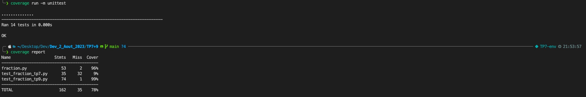

# TP7 et TP9 spécification, implémentation et test de la classe fraction : 

## TP7 : 

### compétences visées : 

- Utiliser un IDE
- Utiliser à bon escient les structures de contrôle Python
- Utiliser à bon escient les principes Orienté-Objet (classes, objects, ...)
- Respecter les bonnes pratiques de programmation : Choix des variables, respects d'un style de codage (PEP8), bon usage et simplification des structures de contrôle, mise en page des fichiers sources, ...
- Configurer et utiliser un linter dans un IDE

- Sur base d'un diagramme UML ou d'une spécification informelle, spécifier les méthodes d'une classe ou les fichiers d'une librairie selon la programmation par contrat
- Réaliser une application fonctionnelle dont les constituants respectent des spécifications données (UML, spécifications PRE/POST, ...)
- Réaliser une application fonctionnelle exploitant les principes OO : Encapsulation, surcharge de méthodes, héritage, ...
- Réaliser une application robuste en exploitant le mécanisme des exceptions pour la gestion des cas particuliers

## TP9

### compétences visées : 

- Sur base d'une spécification, produire un tableau input/output listant les cas de figure qu'il faut tester afin de prouver la robustesse d'une méthode ou d'une fonction
- Sur base d'un tableau de valeur, implémenter des tests unitaires fonctionnels pour valider une méthode
- Valider une application avec une couverture de tests suffisante

preuve de la couverture de test de 96%
le fichier exel se situe egalement dans le repertoire 
